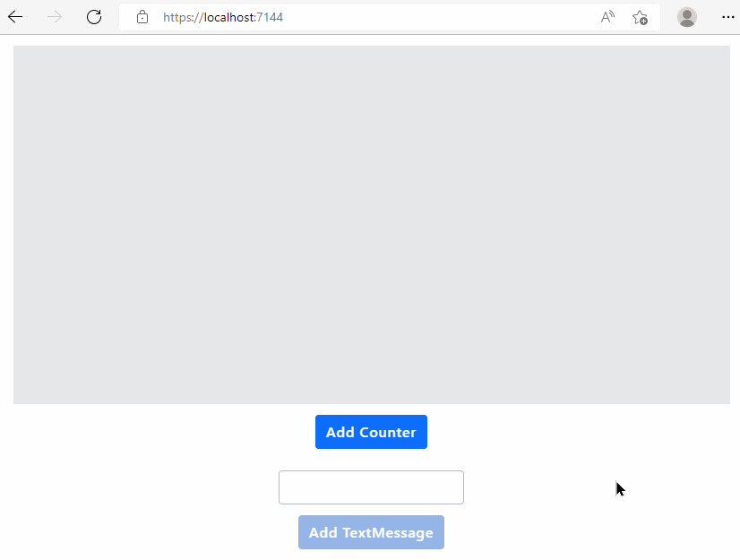

# ドックマネージャーによる高度なレイアウト機能を備えた、コンポーネントを動的に追加できる Blazor アプリケーションを作る

## 概要

このリポジトリは、インフラジスティックス・ジャパン株式会社 Blog の下記記事で紹介しているサンプルアプリケーションのソースコード一式です。

- [📢 ドックマネージャーによる高度なレイアウト機能を備えた、コンポーネントを動的に追加できる Blazor アプリケーションを作る (前編)](https://blogs.jp.infragistics.com/entry/igbdockmanager-with-dynamiccomponent-part1)
- [📢 ドックマネージャーによる高度なレイアウト機能を備えた、コンポーネントを動的に追加できる Blazor アプリケーションを作る (後編)](https://blogs.jp.infragistics.com/entry/igbdockmanager-with-dynamiccomponent-part2)

## ライブデモ

下記リンク先で、実際に動く様子を確認頂けます。

- https://igjp-sample.github.io/IgbDockManagerDemo/

## Ignite UI for Blazor のライセンスをお持ちでない場合はトライアル版でご試用ください

このリポジトリに収録されているソースコードをビルド、実行するにあたり、Ignite UI for Blzor のライセンスをお持ちでない場合は、30 日間のサポート付きトライアル版への登録が必要です。  
トライアル版のダウンロードは、下記リンク先のフォームに必要事項を記入頂くことで可能です。

[🚀 Ignite UI for Blazor
無料トライアル版のダウンロード](https://jp.infragistics.com/products/ignite-ui-blazor/download)